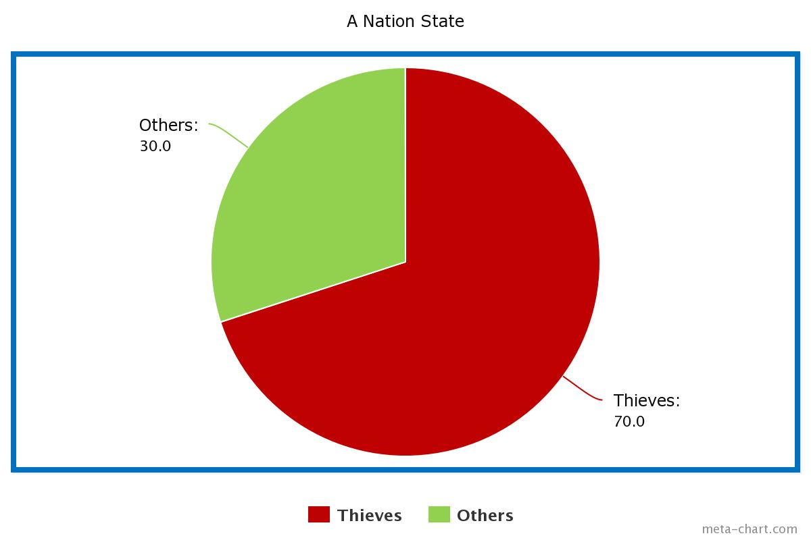

# DEMOCRACY VERSUS THEOCRACY

* In a democratic society, eligible citizens are able to vote for the passing or rejecting of laws.
* Let us assume that there is a large group of people in which majority of them are thieves by profession (> 50% of the population are theives). 
* Let the large group of people establish an autonomous state. The group of people now decide that they need to make laws for the new state. They decide to follow the model of democracy (which they already did by actually deciding to adopt democracy).
* Now let us assume that they wanted to decide on the following question:
	* *Should theft be legalized?*
* For this purpose, voting system was adopted as prescribed by democracy and the decision was made based on whether the majority voted for or against legalizing theft. A rhetorical question would be, did the state legalize theft?
* The answer to this question is obvious. Yes they did!
* From the above hypthetical case, we come to understand that democracy can legalize acts that are morally corrupt and therefore it is an unreliable system.

### GOD'S LAW
* *Assumption:* Let us assume that another large group of people believe in the existence of All Mighty GOD and also believes that a book of law **L** was sent by All Mighty GOD for it's people to follow.
	* *Statement:* ***Following God's Law is not worse than following democracy***
	* *Proof:* Let us apply proof by contradiction. Let us assume that Democracy is always better than Theocracy. But in the above example, there is always a possibility that democracy can lead to adopting the most morally corrupt laws when there is a majority of people who are most morally corrupt. Thus there is always a possibility that all the laws in a democratic system can be most morally corrupt. This implies that democracy in certain cases can be the most morally corrupt system to ever exist. Therefore, any such exceptional case proves that democracy can be worse than or as worse as theocracy (if theocracy is assumed to be the worst of all). Thus this contradicts our initial assumption that Democracy is always better than Theocracy. Hence the proof.
	* *Statement:* ******